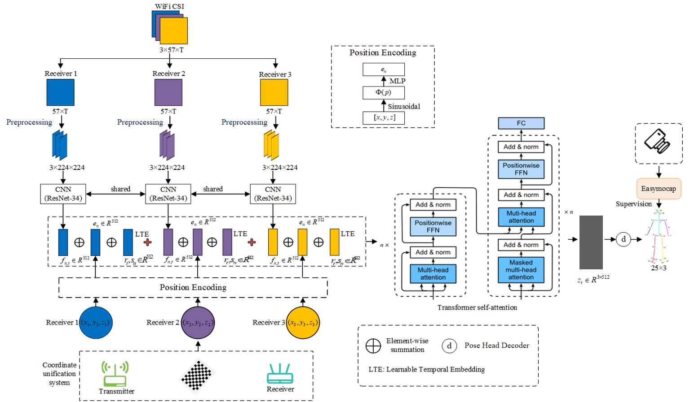
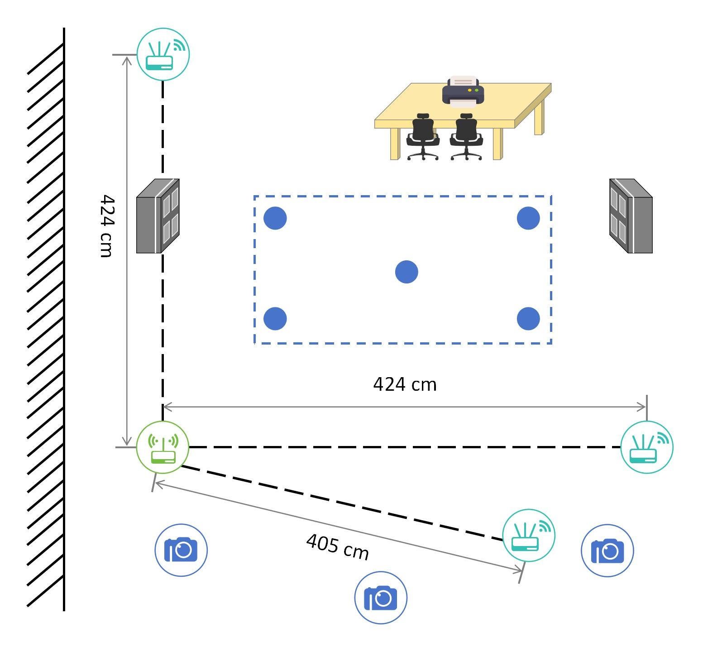
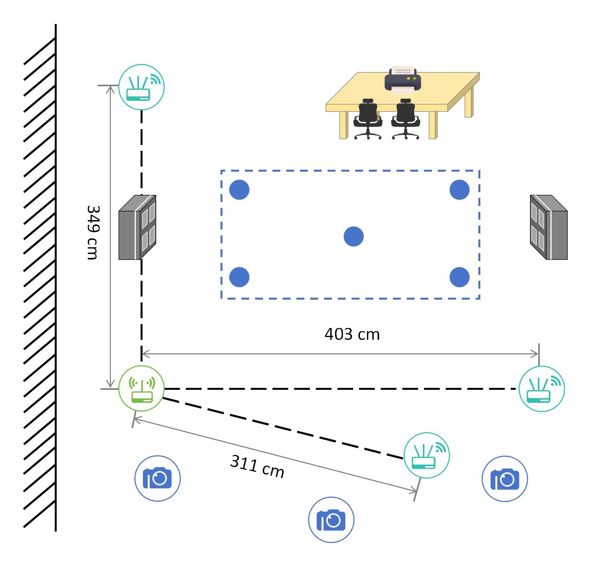
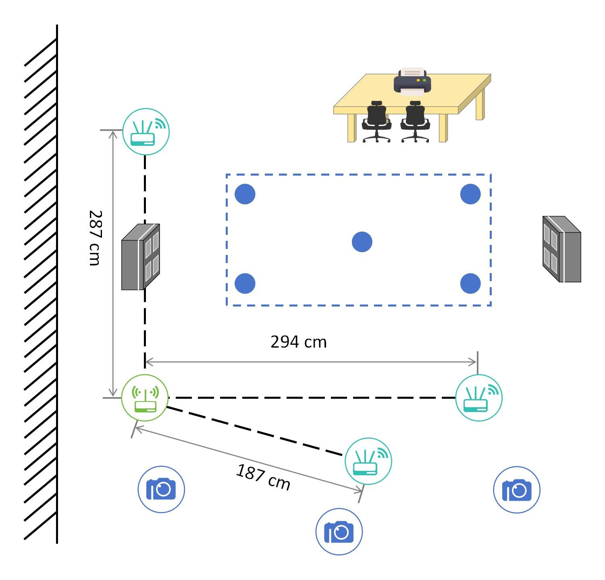

# PerceptAlign: Breaking Coordinate Overfitting in WiFi Sensing: Geometry-Aware WiFi Sensing for Cross-Layout 3D Pose Estimation

**Breaking Coordinate Overfitting: Geometry-Aware WiFi Sensing for Cross-Layout 3D Pose Estimation**

Paper: `paper/MobiCom_2026.pdf`

## Introduction

WiFi-based 3D human pose estimation often suffers from **coordinate overfitting**, where a model memorizes deployment-specific transceiver layouts instead of learning motion-related representations. This typically causes large accuracy drops when the layout changes.

PerceptAlign is a geometry-conditioned framework designed to improve cross-layout generalization by:

- **Lightweight coordinate unification**: aligning WiFi and vision measurements into a shared 3D coordinate system via simple calibration.
- **Geometry-conditioned learning**: encoding calibrated transceiver positions as conditioning signals to disentangle motion from layout.

## Installation

```bash
pip install -r requirements.txt
```

Note: please install **PyTorch** following the official instructions to match your CUDA version: `https://pytorch.org/get-started/locally/`.


## Model Architecture




##  Dataset

### Download links
Raw version:
- **Scene1**: `https://huggingface.co/datasets/Atomathtang/Scene1`
- **Scene2**: `https://huggingface.co/datasets/atomathtang11/Scene2`
- **Scene3**: `https://huggingface.co/datasets/Atomathtang/Scene3`
- **Scene4**: `https://huggingface.co/datasets/atomathtang11/Scene4`
- **Scene5**: `https://huggingface.co/datasets/atomathtang11/Scene5`

**notes**: The vision labels(3D keypoints groundtruth) can be downloded here. `https://huggingface.co/datasets/Songming0612/PerceptAlign_keypoints` The full clean version will be released later.
### Dataset directory layout


```text
Scene1/
├── user1/
│   ├── action1/
│   │   ├── 1-1-1/
│   │   │   ├── csi_mat/
│   │   │   │   ├── 1-r1.mat
│   │   │   │   ├── 1-r2.mat
│   │   │   │   └── 1-r3.mat
│   │   │   └── default/
│   │   │       ├── intri.yml
│   │   │       ├── extri.yml
│   │   │       ├── images/
│   │   │       ├── videos/
│   │   │       └── smplx/keypoints3d/        
│   │   └── ...
│   ├── action2/
│   └── ...
├── user2/
└── ...
```

Each action instance directory is named as `*-*-*` (e.g., `3-1-2`) which means (Location-Orientation-Repitition)


### Scene3 multi-layout setup

- **Scene3**
  - **Layout A**: user1, user2
  - **Layout B**: user3, user4
  - **Layout C**: user5, user6






## Geometry calibration

PerceptAlign supports **geometry-conditioned learning** and **coordinate unification** results is released via a `geometry_config.json`
placed at each `SceneX/` root.

- **Single-layout scenes (Scene1/2/4/5)**: provide `tx`, `rx`, and `scene_matrix` at the top level.
- **Scene3 (multi-layout)**: provide per-layout configs under `layouts` (A/B/C). Preprocess will infer layout from `user*`
  (user1-2 → A, user3-4 → B, user5-6 → C) and attach the correct tx/rx per sample.

Examples:
- `assets/examples/geometry_config_scene2_example.json`

##  Preprocess

```bash

python tools/preprocess.py --scene_root /path/to/SceneX --out_root data/preprocessed_actions --apply_scene_transform
```

##  Training

```bash
torchrun tools/train.py
```

## Data & Hardware Details

- **CSI format**: `1 TX`, `3 RX`, `3 antennas`, `57 subcarriers` (stored as `.mat` under `csi_mat/`).
- **Hardware**: Intel 5300 NIC for CSI collection; Intel RealSense D435 for RGB video capture.

## Action ID Mapping

| Action ID | Description |
| --- | --- |
| action1 | Left arm stretch |
| action2 | Right arm stretch |
| action3 | Both-arms stretch |
| action4 | Left forward lunge |
| action5 | Right forward lunge |
| action6 | Left lateral lunge |
| action7 | Right lateral lunge |
| action8 | Squat |
| action9 | Left lateral raise |
| action10 | Right lateral raise |
| action11 | Jump |
| action12 | Pick up |
| action13 | Jump (forward/back/left/right) |
| action14 | Clockwise spin|
| action15 | Counter-clockwise spin|
| action16 | Jumping jack |
| action17 | left and right rotation | 

note: We collected action (17) and action (18) published together here in action 17.
